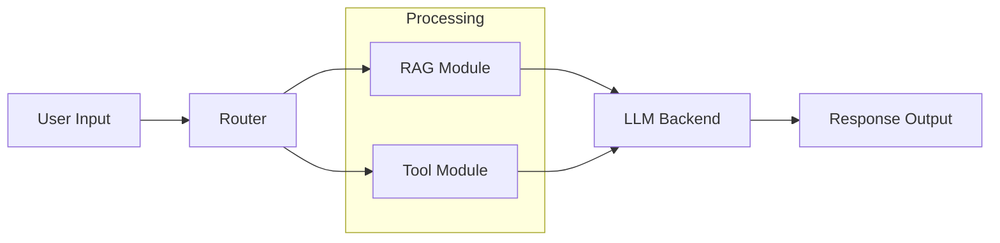
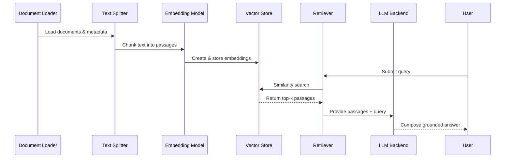
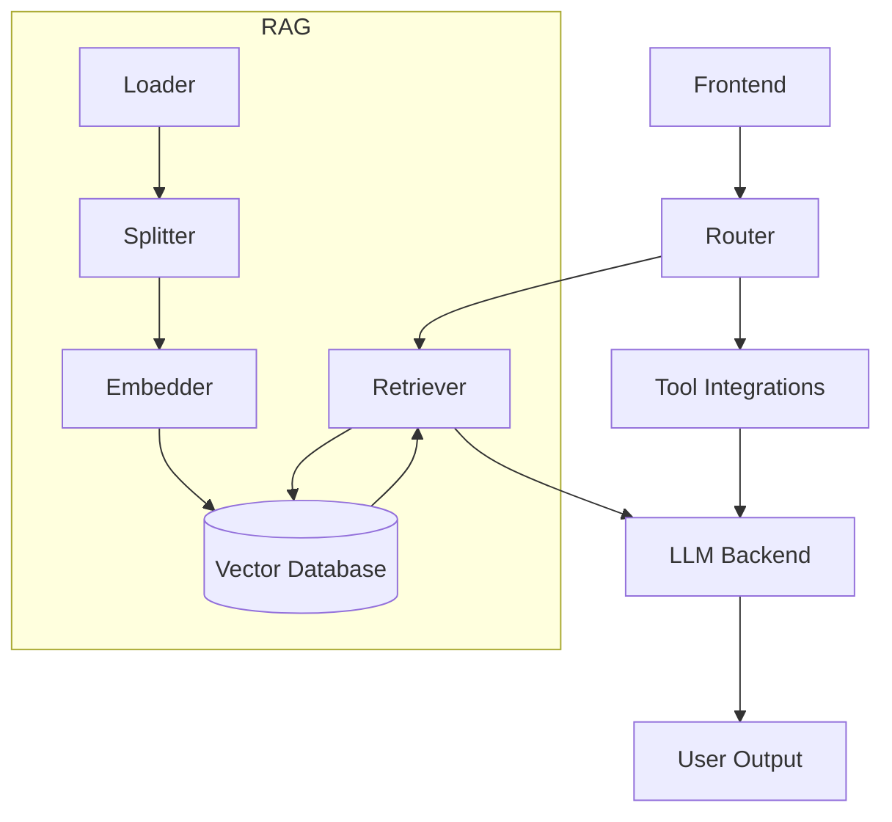

# System Architecture Overview

## Overall System Design

The system begins with the **User** submitting a question through the frontend. A lightweight **Router** analyses the intent and routes the request to the Retrieval-Augmented Generation (**RAG**) pipeline, external **Tools**, or both. Outputs from the selected modules are consolidated and passed into the **LLM Backend**, which produces the final response delivered back to the user interface.

## Data Flow Explanation

1. **User Query Intake** – The frontend captures natural-language input and forwards it to the router service.
2. **Routing Decision** – The router scores the query against routing heuristics (e.g., whether retrieval is required or a calculator/tool call would be more reliable).
3. **Module Execution** –
   - If RAG is chosen, the system retrieves supporting passages from the vector store.
   - If a tool is needed, the router orchestrates the call and gathers the tool's results.
   - For hybrid tasks, both steps execute and their results are merged.
4. **LLM Synthesis** – The LLM backend consumes the enriched context (retrieved passages, tool results, and original question) and drafts the response.
5. **Response Delivery** – The final message is returned to the frontend and displayed to the user.

This flow ensures that grounding evidence and structured tool outputs supplement the LLM, reducing hallucinations and improving accuracy.

## RAG Pipeline

The RAG pipeline begins by **loading** domain documents, **splitting** them into digestible chunks, and **embedding** each chunk into vector representations that are stored in the **vector database**. During query time, the **retriever** embeds the user question, performs similarity search against the vector database, and forwards the most relevant passages to the **LLM**, which synthesizes a grounded response for the user.

## Component Descriptions

| Component | Description |
|-----------|-------------|
| Router | Lightweight intent classifier that decides whether to invoke RAG retrieval, external tools, or both, based on the user query. |
| RAG Module | Handles document ingestion, chunking, embedding, and retrieval from the vector database to provide grounded context to the LLM. |
| Tool Module | Wraps deterministic utilities (e.g., calculators, lookup APIs) and exposes them to the LLM through function-calling interfaces. |
| LLM Backend | Core language model that consumes the router instructions, retrieved passages, and tool outputs to generate the final answer. |
| Frontend | User-facing interface that collects input, renders responses, and displays references returned by the backend. |

Each component collaborates to deliver accurate, explainable responses by pairing retrieval with targeted tool usage.

## Data Flow Summary Diagram

This summary diagram reiterates how the frontend, router, RAG stages, tool integrations, and LLM backend connect to deliver grounded answers. It visualizes the preprocessing (document loading and embedding), the runtime retrieval loop, and the integration of deterministic tool outputs before the final response is returned to the user.

